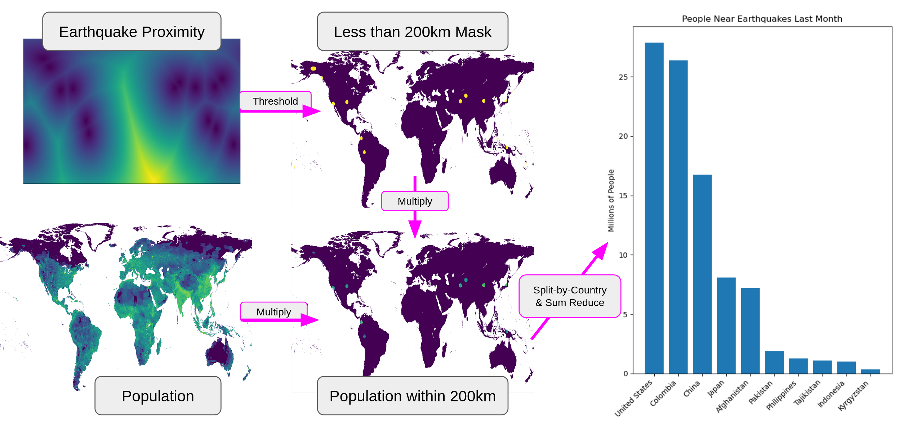

# Flowcast

A framework for dynamically combining gridded netcdf data to derive new insights.

## Example Scenario: Population Near Recent Earthquakes

A simple use case to demonstrate some of the capability of Flowcast is to calculate the number of people (by country) living near recent significant earthquakes.

### Data Sources:

- [USGS Earthquakes Hazards Program: Realtime Feeds](https://earthquake.usgs.gov/earthquakes/feed/v1.0/csv.php). We will take the CSV of all major earthquakes within the last 30 days
- [Global 1-km Downscaled Population Base Year and Projection Grids Based on the SSPs, v1.01 (2000 – 2100)](https://sedac.ciesin.columbia.edu/data/set/popdynamics-1-km-downscaled-pop-base-year-projection-ssp-2000-2100-rev01). We select year 2020 as a stand in for the current world population

### Scenario Explanation:

1. Convert earthquake coordinates to a distance field so that it can be utilized by the data modeler
1. Threshold the distance field for values less than 200km to get a mask (i.e. locations where the proximity to an earthquake within 200km)
1. Multiply the mask by the population data to select populations within the target proximity
1. Separated by country, and sum to get the final affected populations

> A more in-depth analysis might involve computing magnitude of shaking experienced at each point, and selecting for people who experienced shaking above some threshold

### Scenario Diagram:



### Scenario Code:

This is largely adapted from [disaster.py](demos/data/non_climate_scenarios/disaster.py) in the Flowcast repository

```python
import pandas as pd
from flowcast.pipeline import Pipeline, Variable, Threshold, ThresholdType
from flowcast.regrid import RegridType as GeoRegridType
from flowcast.spacetime import points_to_mask

from data import OtherData, Scenario # for population data must have data downloaded locally

# load earthquake data as lat/lon points, and convert to a gridded mask
quake_df = pd.read_csv('https://earthquake.usgs.gov/earthquakes/feed/v1.0/summary/all_month.csv')
quake_lats, quake_lons = quake_df['latitude'].values, quake_df['longitude'].values
quake_spots = points_to_mask(quake_lats, quake_lons, n_lat=1800, n_lon=3600)

# create the pipeline and add data operations
pipe = Pipeline()
pipe.load('pop', OtherData.population(scenario=Scenario.ssp585))
pipe.load('quake_spots', lambda: Variable(quake_spots, time_regrid_type=None, geo_regrid_type=GeoRegridType.interp_or_mean))
pipe.set_geo_resolution('pop')
pipe.set_time_resolution('pop')

pipe.isel('pop2020', 'pop', indexers={'time':1})
pipe.mask_to_distance_field('sdf', 'quake_spots', include_initial_points=True)
pipe.threshold('near_quake', 'sdf', Threshold(200, ThresholdType.less_than))
pipe.multiply('affected_pop', 'pop2020', 'near_quake')

pipe.reverse_geocode('affected_countries', 'affected_pop',
    places=[
        'United States',
        'Colombia',
        'Brazil',
        'China',
        'India',
        'Japan',
        ... # full list truncated
    ]
)
pipe.sum_reduce('affected_counts', 'affected_countries', dims=['lat', 'lon'])

# run all the steps in the pipeline
pipe.execute()

# plot bar chart of top 10 countries
from matplotlib import pyplot as plt
import numpy as np

res = pipe.get_last_value().data
countries,values = zip(*(list(sorted(zip(res.admin0.values, res.values), key=lambda x: x[1], reverse=True))[:10]))
plt.bar(countries, np.array(values) / 1e6)
plt.xticks(rotation=45, ha='right')
plt.title('People Near Earthquakes Last Month')
plt.ylabel('Millions of People')
plt.xlabel('Country')
plt.show()
```

## Overview

To create a dynamic insight, the user will:

1. create an empty pipeline
2. add steps to the pipeline
   - while steps are added, several compile-time checks are performed to validate the pipeline
3. execute the pipeline

## Compilation vs Execution

Pipelines separate out compilation/building the pipeline from execution because the operations on datasets may be expensive, and ideally we would like to know before we run the pipeline if there is a problem that would cause it to crash.

## Pipeline steps

A step in a pipeline is usually some operation on a dataset. Most steps will produce a new result dataset, which the user must name, and can be used in subsequent steps.

### Static Single Assignment

No steps should modify data in place--all data are treated as constant, and names may not be reused. This is called Static Single Assignment (SSA), and is a common technique in compilers for reducing complexity. SSA is used here mainly to simplify regridding logic:

- Regridding can target matching existing data's resolution. If that existing data were to later change resolution, it would be more difficult to bookkeep and make sure any dependent data gets updated as well

In practice, what this means is that instead of a pipeline looking like this:

```
x = load_data(...)
y = load_data(...)
x = x > 100
y = y * x
y = y.sum(dims=['lat', 'lon'])
y = y.reverse_geocode(['China', 'India', 'United States', 'Canada', 'Mexico'])
y.save('result.nc')
```

new names are needed for each step:

```
x1 = load_data(...)
y1 = load_data(...)
x2 = x1 > 100
y2 = y * x2
y3 = y2.sum(dims=['lat', 'lon'])
y4 = y3.reverse_geocode(['China', 'India', 'United States', 'Canada', 'Mexico'])
y4.save('result.nc')
```

### Pipeline operations

steps include things like:

- loading data
- geo/temporal regridding
- unary operations on a single dataset (threshold, etc.)
- binary operations between two datasets (add, multiply, divide, etc.)
- aggregating over a dataset's dimensions
- reverse geocoding a dataset to countries
- save data to a file

### Compile-time checks

The main compile-time checks performed on a pipeline are:

- ensuring variable names are not reused (enforcing SSA)
- ensuring geo/temporal regridding targets are set before operations that will require regridding

## Example

An example pipeline for the extreme heat scenario:

```
# extreme heat scenario: how many people will be exposed to extreme heat events (e.g., heatwaves) in the future?
pipe = Pipeline()

# set geo/temporal resolution targets for operations in the pipeline
pipe.set_geo_resolution('pop')
pipe.set_time_resolution(Frequency.yearly)

# load the data
pipe.load('pop', OtherData.population(scenario=Scenario.ssp585))
pipe.load('tasmax', CMIP6Data.tasmax(model=Model.CAS_ESM2_0, scenario=Scenario.ssp585, realization=Realization.r1i1p1f1))

# operations on the data to perform the scenario
pipe.threshold('heat', 'tasmax', Threshold(308.15, ThresholdType.greater_than))
pipe.multiply('exposure0', 'heat', 'pop')
pipe.reverse_geocode('exposure1', 'exposure0', ['China', 'India', 'United States', 'Canada', 'Mexico'])
pipe.sum_reduce('exposure2', 'exposure1', dims=['lat', 'lon'])
pipe.save('exposure2', 'exposure.nc')

# run the pipeline
pipe.execute()
```

which basically gets converted to the following operations:

```
pop = load_population_data()                #from some external data source
tasmax = load_tasmax_data(Model.CAS_ESM2_0) #from some external data source

# automatically regrid tasmax to match pop's geo resolution and to yearly frequency
__tmp_0__ = geo_regrid(tasmax, match=pop)
__tmp_1__ = time_regrid(__tmp_0__, yearly)

# automatically regrid pop to yearly frequency
__tmp_2__ = regrid(pop, yearly)

# actual steps in the pipeline
heat = __tmp_1__ > 35°C
exposure0 = heat * __tmp_2__
exposure1 = reverse_geocode(exposure0, ['China', 'India', 'United States', 'Canada', 'Mexico'])
exposure2 = exposure1.sum(dims=['lat', 'lon'])
exposure2.to_netcdf('exposure.nc')
```

user can build a pipeline of steps by sequentially calling operations (e.g. load data, threshold, multiply, save data, etc.), and specifying input variable names and names for the results
as the user builds the pipeline, the Pipeline class runs several "compile-time" checks, such as ensuring variable names are valid, ensuring data will be regridded if necessary, etc.
Once the pipeline is built, it can be executed, which performs all of the accumulated steps in sequence
separate compile/execute phases are so that you don't have to wait for expensive data operations to know if something's invalid

## Compilation

The [`Pipeline`](dynamic_insights.py#L252) class provides an [`@compile`](dynamic_insights.py#L291) decorator which is used to annotate methods that will be used as pipeline operations. The decorator will perform several compile-time checks, and then saves the method in a list of pipeline steps to be executed later.

## Dynamic Regridding

Data frequently is not at a common geo/temporal resolution and requires regridding to be used together with other data. During pipeline execution, the current data's resolution/frequency is stored with the data as part of the [`Variable`](dynamic_insights.py#L215) class. When an operation is to be performed with one or more variables, their current frequency/resolution is compared to the current target frequency/resolution of the pipeline, and if they do not match, a regridding operation is called. The result is given a temporary identifier, which is used in the operation in place of the original un-regridded data.

## Pipeline Operation Signatures

Here are some example signatures for pipeline operations:

```
def set_geo_resolution(self, target:Resolution|str): ...
def set_time_resolution(self, target:Frequency|str): ...
def load(self, name:ResultID, /, loader:Callable[[], Variable]): ...
def threshold(self, y:ResultID, x:OperandID, /, threshold:Threshold): ...
def multiply(self, y:ResultID, x1:OperandID, x2:OperandID, /): ...
def reverse_geocode(self, y:ResultID, x:OperandID, /, countries:list[str]): ...
def sum(self, y:ResultID, x:OperandID, /, dims:list[str]): ...
def save(self, x:OperandID, /, path:str): ...
```

Some things to note:

- All of these are annotated with `@compile` which means when they are called, they are added to the pipeline's list of steps, and their execution is deferred to when `pipeline.execute()` is called
- `set_geo_resolution` and `set_time_resolution` don't operate on any data, and instead manage global pipeline settings. They just look like normal methods with no special considerations (other than being annotated with `@compile`).
- `load`, `threshold`, `multiply`, `reverse_geocode`, and `sum` all produce a result value, which is named by the user. Resulting values should use the `ResultID` type annotation, and be position-only values (positional only is achieved with the `/` in the signature). By convention, the result value is the first argument in the method signature, and also I've been calling it `y`.
- `threshold`, `multiply`, `reverse_geocode`, `sum`, and `save` all take input arguments, which must refer to existing data in the pipeline namespace. Input values should use the `OperandID` type annotation, and be position-only values (positional only is achieved with the `/` in the signature). By convention, the input values follow the result value (if any), and I've been calling them `x`, `x1`, `x2`, etc.
- any relevant non-identifier arguments can appear wherever make sense. Typically I put them after the `/` making them positional or keyword arguments.

## Misc Notes:

- to call an `@compile` decorated function immediately (rather than add it to the pipeline, which is the default behavior), methods have a `.unwrapped` property, which returns the original unwrapped version of the function. This is useful if you want to use one of the methods inside a pipeline method at runtime, e.g. as is done in the [`auto_regrid()`](dynamic_insights.py#L683) method.
- geo and temporal regridding has two types, `fixed` and `matched` which refers to which type of target is used for the regridding:
  - fixed targets a static resolution/frequency, e.g. 1°x1°, 1 month
  - matched targets (by name) the resolution/frequency of another dataset in the pipeline
